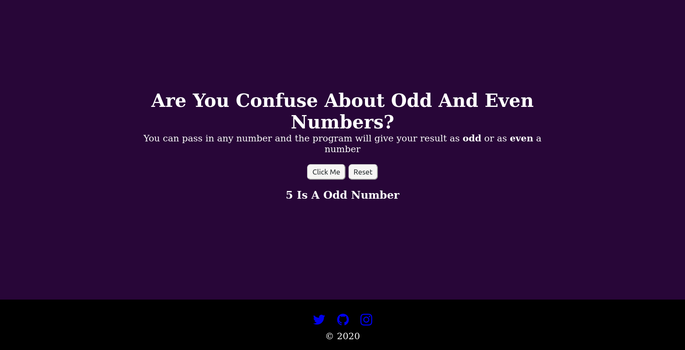

# Even and Odd Numbers

You can pass in any number and the program will give your result as **odd** or as **even** a number

## Preview 

## Build With:

* HTML
* CSS
* JavaScript 

[See Demo](https://touraye.github.io/2ray-odd-even-number.github.oi/)

